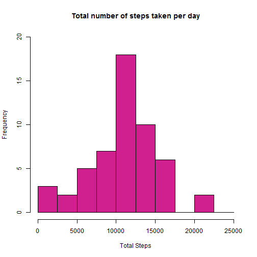
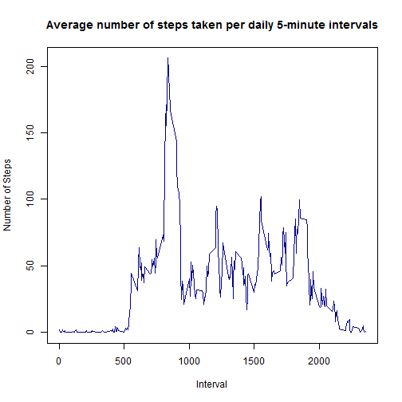
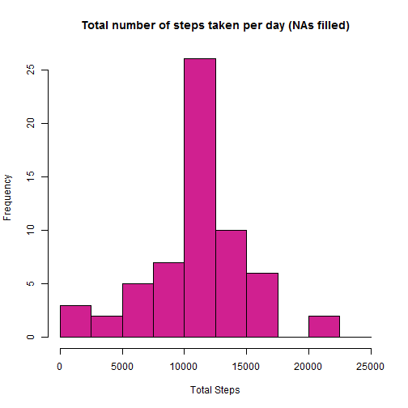
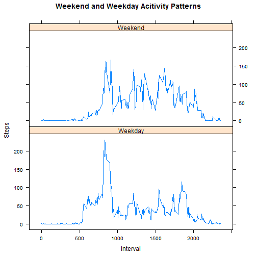

Reproducible Research: Peer Assessment 1
===================================
#### Joonas Korkealaakso  
#### 13.11.2015

## Loading and preprocessing the data
1. Load the data (i.e. `read.csv()`)


```r
# Set the working directory to the local copy of the github repository
setwd("U:/RepData_PeerAssessment1")

# Unzip the activity data
unzip("activity.zip")

# Read the activity.csv dataset into R
activity_data <- read.csv("activity.csv")

# Preview the first rows of the loaded dataset
head(activity_data)
```

```
##   steps       date interval
## 1    NA 2012-10-01        0
## 2    NA 2012-10-01        5
## 3    NA 2012-10-01       10
## 4    NA 2012-10-01       15
## 5    NA 2012-10-01       20
## 6    NA 2012-10-01       25
```

2. Process/transform the data (if necessary) into a format suitable for analysis


```r
#Set R options to suppress scientific notations and round values to nearest 'whole' steps.
options(scipen = 1, digits = 0)

# Transform the date variable into actual date format (YYYY-MM-DD)
activity_data$date <- as.Date(activity_data$date, "%Y-%m-%d")
```

## What is mean total number of steps taken per day?
For this part of the assignment, you can ignore the missing values in the dataset.

1. Make a histogram of the total number of steps taken each day


```r
# Get the sum of steps for each date using the aggregate function ignoring the NAs
total_steps <- aggregate(steps ~ date, data = activity_data, sum, na.rm=TRUE)

# Look at the first rows of the new data set
head(total_steps)
```

```
##         date steps
## 1 2012-10-02   126
## 2 2012-10-03 11352
## 3 2012-10-04 12116
## 4 2012-10-05 13294
## 5 2012-10-06 15420
## 6 2012-10-07 11015
```

```r
# Plot a histogram for total number of steps per day
hist(total_steps$steps, breaks=seq(from=0, to=25000, by=2500), 
     main = "Total number of steps taken per day", 
     xlab = "Total Steps",ylim=c(0, 20), col = "violetred")
```

 

2. Calculate and report the mean and median total number of steps taken per day


```r
mean(total_steps$steps)
```

```
## [1] 10766
```

```r
median(total_steps$steps)
```

```
## [1] 10765
```

The mean total number of steps taken per day was **10766** and the median total number of steps taken per day was **10765**.
 
## What is the average daily activity pattern?

1. Make a time series plot (i.e. `type = "l"`) of the 5-minute interval (x-axis) and the average number of steps taken, averaged across all days (y-axis)


```r
# Get the mean of steps for each daily interval using the aggregate function
interval_steps <- aggregate(steps ~ interval, data = activity_data, mean)

# Preview the first rows of the created dataset
head(interval_steps) 
```

```
##   interval steps
## 1        0     2
## 2        5     0
## 3       10     0
## 4       15     0
## 5       20     0
## 6       25     2
```

```r
# Make a time series plot for total number of steps per daily interval
plot(interval_steps$interval, interval_steps$steps, type = "l", 
     main = "Average number of steps taken per daily 5-minute intervals",
     ylab = "Number of Steps",xlab = "Interval", col = "blue4", lty = 1)
```

 

2. Which 5-minute interval, on average across all the days in the dataset, contains the maximum number of steps?


```r
# Find the interval with the highest average step number
maxposition <- which.max(interval_steps$steps)
interval_steps[maxposition, 1]
```

```
## [1] 835
```

The 5-minute interval **835** contained the maximum number of steps on average with **206**.

## Imputing missing values
Note that there are a number of days/intervals where there are missing values (coded as  `NA`). The presence of missing days may introduce bias into some calculations or summaries of the data.

1. Calculate and report the total number of missing values in the dataset (i.e. the total number of rows with `NA`s)

```r
# Calculate the sum of rows with missing values
sum(is.na(activity_data$steps))
```

```
## [1] 2304
```
The number of rows with missing values (`NA`s) is **2304**.

2. Devise a strategy for filling in all of the missing values in the dataset. The strategy does not need to be sophisticated. For example, you could use the mean/median for that day, or the mean for that 5-minute interval, etc.

```r
# Create new data frame with mean values for each interval
withNAs <- merge(activity_data, interval_steps, by = "interval")

# Subset and substitute all NAs with the average number of steps for that interval
NAs <- is.na(withNAs$steps.x)
withNAs$steps.x[NAs] <- withNAs$steps.y[NAs]
```

3. Create a new dataset that is equal to the original dataset but with the missing data filled in.

```r
# Select the interval, filled mean steps, and date columns and reorder to match the original data
withNAs <- withNAs[,1:3]
withNAs <- withNAs[,c(2,3,1)]

# Rename the columns to match the orignal dataset
names(withNAs) <- c("steps","date","interval")

# Preview the first rows of the dataset with filled in NAs
head(withNAs)
```

```
##   steps       date interval
## 1     2 2012-10-01        0
## 2     0 2012-11-23        0
## 3     0 2012-10-28        0
## 4     0 2012-11-06        0
## 5     0 2012-11-24        0
## 6     0 2012-11-15        0
```

4. Make a histogram of the total number of steps taken each day and Calculate and report the **mean** and **median** total number of steps taken per day. Do these values differ from the estimates from the first part of the assignment? What is the impact of imputing missing data on the estimates of the total daily number of steps?


```r
# Get the sum of steps for each day from the dataset with the NAs filled using the aggregate function
stepswithNAs <- aggregate(steps ~ date, data = withNAs, sum)

# Create a histogram displaying the total number of steps per day from the dataset with NAs filled in
hist(stepswithNAs$steps,breaks=seq(from=0, to=25000, by=2500),
     main = "Total number of steps taken per day (NAs filled)", 
     xlab = "Total Steps", col = "violetred")
```

 

```r
#Calculate the mean number of steps taken per day from the new dataset
mean(stepswithNAs$steps)
```

```
## [1] 10766
```

```r
#Calculate the median number of steps taken per day from the new dataset
median(stepswithNAs$steps)
```

```
## [1] 10766
```

The mean total number of steps taken per day was **10766** and the median total number of steps taken per day was **10766** with the NAs filled in.

The impact of imputing missing data on the estimes of the total daily number of steps was basically **non-existent**. The original median value of **10765** steps increased by **1** step to **10766** steps as the number of observations grew.

## Are there differences in activity patterns between weekdays and weekends?
For this part the `weekdays()` function may be of some help here. Use the dataset with the filled-in missing values for this part.

1. Create a new factor variable in the dataset with two levels -- "weekday" and "weekend" indicating whether a given date is a weekday or weekend day.

```r
# Set system time settings to English in order to work with the *weekdays()* function
Sys.setlocale("LC_TIME", locale = "English")
```

```
## [1] "English_United States.1252"
```

```r
# Create a new data frame and transform the dates into corresponding weekdays - i.e. 'Monday', 'Tuesday',...
weekdaydata <- withNAs
day <- weekdays(weekdaydata$date)

# Create a factor variable separating the 'weekday' and 'weekend' days from one another
daytype <- ifelse(day == "Saturday" | day == "Sunday","Weekend", "Weekday")
daytype <- as.factor(daytype)

# Replace the original dates with the 'weekend' and 'weekday' factor variables
weekdaydata$date <- daytype

# Preview the first rows of the new dataset
head(weekdaydata)
```

```
##   steps    date interval
## 1     2 Weekday        0
## 2     0 Weekday        0
## 3     0 Weekend        0
## 4     0 Weekday        0
## 5     0 Weekend        0
## 6     0 Weekday        0
```

2. Make a panel plot containing a time series plot (i.e. `type = "l"` ) of the 5-minute interval (x-axis) and the average number of steps taken, averaged across all weekday days or weekend days (y-axis). The plot should look something like the following, which was created using **simulated data**:


```r
# Calculate the mean number of steps per interval and type of day ('weekend' or 'weekday')
mean_steps <- aggregate(steps ~ interval + daytype, data = weekdaydata, mean)

# Load the 'lattice' graphics package into R
library(lattice)

# Create a time series plot with the average number of steps per 5-minute interval for both day types
xyplot(steps~interval|daytype, mean_steps, type="l", layout = c(1,2),
       main = "Weekend and Weekday Acitivity Patterns",
       xlab = "Interval", ylab = "Steps")
```

 
